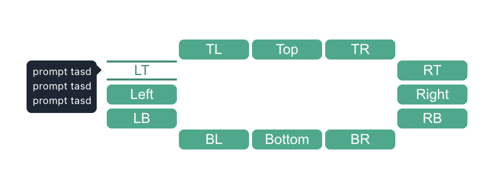
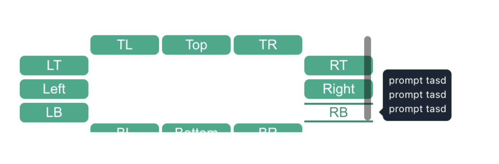
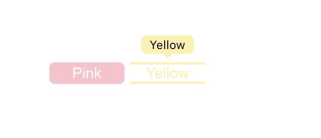

# Tooltip

> 실행 : npm i - npm run start

#### 사용 기술

    React, TypeScript

#### Install

    emtion : CSS-in-JS의 종류 중 하나로 JavaScript 안에서 스타일을 작성하는데 사용함.
    toastify-alert : alert를 띄워주는 라이브러리 사용 (Top, Bottom, Left, Right)에서 click시 사용

## 컴포넌트 구현 로직 혹은 아키텍쳐

### TooltipButton

기본적인 TooltipButton 컴포넌트는 hover시에 안에 상세 내용을 띄워주는 컴포넌트입니다.<br/>
이러한 컴포넌트는 다양한 props를 이용하여 하나로 관리합니다. 다음 아래와 같은 props가 있습니다.

    children : 컴포넌트 안에 세부적인 내용입니다.
    width : 짧은 Tooltip인지 긴 컴포넌트인지 확인합니다. <설정을 하지 않으면 기본 값으로 짧은 컴포넌트로 인지됩니다.>
    color : 컴포넌트의 전체적인 색깔 즉 backGround를 판단합니다. <설정을 하지 않으면 기본 값으로 #1aab8a 색깔이 지정됩니다. >
    direction : tooltip을 hover했을 때 생기는 Content 컴포넌트의 방향을 이야기합니다. <TL, Top, TR, LT .. 외 8개>
    number : delay 시간을 조정할 수 있습니다. number가 지정된 시간 만큼 delay가 걸립니다. <Enter, Leave, Base .. >
    type : delay에 관련 된 Section일 경우 판단합니다. <enter-delay인지 leave-delay로 판단합니다.>
    conent : hover시에 생기는 안에 Content 내용입니다. <CheckContent, Color, able, scroll이 존재합니다. 기본 값 지정됨>
    fontColor : 세부적인 font-color를 지정해줍니다. <없을 경우에는 white가 기본 값입니다.>
    isClick : content able Section 6일 경우에 사용하는 props로 onClick의 여부를 boolean으로 상태 관리하였습니다.
    onClick : Enable, Disable Section에서 사용합니다.

### Section 1

Section 1 에서는 12방향을 가르키는 Tooltip Container를 제작하였습니다.


Button을 hover시에 기본 base이기 때문에 Content 컴포넌트를 보여지게 됩니다. 여기서는 2가지의 컴포넌트로 나뉘는데 <br/>
Direction과 Content로 나뉘게 됩니다.

    Direction : 방향을 나타내는 삼각형 컴포넌트
    Conent : hover시에 생기는 내용

    Content : Content 컴포넌트 같은 경우에는 direction의 props를 받아서 위치를 나타냈습니다. 각각의 위치 Top, Left, Bottom, Right로
    기본적으로 좌표를 지정해주고 그 상태에서 상위 태그에서 position을 이용하여서 위치를 나타냈습니다.

    Direction : Direction 컴포넌트 같은 경우에는 Top, Left, Bottom, Right일 경우 각각 가르키는 방향을 나타내기 위해서 사용합니다.
    그존에 Direction.ts에 각각의 x, y 좌표를 설정하고 props로 받아온 direction의 위치를 파악해서 설정해줍니다.

## Section 2

Section 2는 Section1과 다를 것이 없습니다. 같은 형태지만 Section1 Container 상위 태그가 overflow: hidden, scroll 등 .. 입니다.<br/>
그러기에 scroll 안에서는 상위에 있는 태그가 보이지 않습니다. 그러기에 제가 도출해낸 방법은 2가지 였습니다.
)

    방법 1 : Section1의 Content 컴포넌트는 postion: relative였지만 Section2 scroll 일 때는 fixed로 고정하여 상위에 보이게 하는 방법.

    방법 2 : relative 속성 안에 overflow: scroll 속성인 container 하위에는 fragment를 두고 그 하위에는 TooltipButton과 Content를 두는 방법.
    fragment안에 있는 속성에 absolute를 주기. 위와 같은 방법은 overflow: scroll 부모 요소인 relative를 고려한 방법입니다.

    방법 3 : Portal 컴포넌트를 사용함으로 index.html의 가장 최상위 태그로 끌어올리는 방법. <컴포넌트를 추가했습니다.>

## Section 3

section 3에서는 delay를 할 수 있는 TooltipButton과 user가 UI 인터페이스에서 직접적인 custom이 가능합니다.<br/>
기본적으로 TooltipButton의 컴포넌트 넓이가 넓기 때문에 width를 설정해주었습니다. <유동적이라면 따로 컴포넌트 제작도 가능 ⭕️><br>
delay할 시간을 정해줘야 합니다. 기본 `1초가 default`입니다.

    추가적으로 user들이 custom이 가능하도록 Input을 통해서 number를 관리하며 그 number를 통해서 delay시간을 조정할 수 있습니다.
    <setTimeout을 이용하여서 delay-enter, delay-leave를 사용하였습니다.>

### 발생 결함 문제 : 1초라고 가정을 하고 hover시에 생기는 Content 컴포넌트를 setTimout으로 동시성 결함

    예를 들어 1번 enter-delay를 hover를 안 하고 3번을 했는데 1번이 동작하는 결함을 발견하였습니다. 시간에 관련된
    setTimeout 함수가 동시성으로 실행이 되어 생기는 결함입니다. 이러한 결함을 해결하기 위해서 아래와 같은 구문을 사용하였습니다.

```ts
const Timeout = useRef<NodeJS.Timeout | null>(null);

// 다음과 같은 Timeout를 통해서 각각의 setTimeout을 관리하고 설정할 수 있었습니다.
```

## Section 4

다음 Section 4에서는 4방향으로 Content 컴포넌트를 나태는 것입니다.<br/>
여기서는 지금까지 사용했던 Content 컴포넌트가 아니라 CheckContent라 해서 yes라는 버튼을 누르면 alert를 뜨게 만듭니다.<br/>
사용되는 alert는 위에 기재하고 사용하였습니다. `toastify-alert 라이브러리` 사용되는 i 아이콘은 assets 폴더안에 svg로 저장하여 사용합니다.<br/>

    기존에 사용되는 Tooltip 컴포넌트는 onMouseLeave일 때 바로 isHover라는 state가 false가 되면서 사라집니다.
    그리고 추가적으로 CheckContent라는 컴포넌트에 따로 state에 관리하려고 하였습니다. 하지만 상위에 있는 isHover라는
    state가 우선이라 사용을 하지 못하여 컴포넌트에  void 형식으로 하위 컴포넌트에서 상위 컴포넌트로 함수를 전달하여 사용했습니다.

### 발생 결함 문제

    CheckContent가 hover가 되었을 때 유지되는 것과 yes라는 버튼을 눌렀을 때 alet가 띄워지는 현상도 완료하였습니다.
    하지만 문제는 CheckConent가 onMouseLeave가 되었을 때 setTimeout을 통하여 설정한 0.5초 뒤에 사라집니다.
    이러한 0.5초 사이에 다시 hover를 한다면 다시 CheckContent가 생기지 않은 문제가 있었습니다. 이러한 문제를 state 상태를
    checkContent 컴포너트만 관리하는 것을 만들어서 조건부 렌더링을 하여서 해결하였습니다.

## Section 5

이번 Section5는 색깔이 관한 Tooltip 컴포넌트입니다.<br/>
기본적으로 color와 fontColor를 다양하게 설정하고 싶은 색으로 지정을 해주면 됩니다. 기본 방향은 Top 방향입니다.<br/>
그리고 설정한 세부 내용인 `React.ReactNode` 내용이 Tooltip 컴포너트 내용과 ColorContent안에 나타나게 됩니다.


> font-color를 black과 base color를 `#fff1aa`설정했습니다.
> Direction은 colorContent일 때는 그림자 효과를 적용시킵니다.

## Section 6

마지막 Section은 Disable과 Enable 두 가지 유형이 있습니다.<br/>
Disable일 때는 hover를 할 때 위에 Content가 보이게 됩니다. 하지만 Enable일 때는 hover시에 보이면 안 됩니다.<br/>
유형이 able이라는 conent일 때만 onClick이 실행이 됩니다. 이러한 값에 따라서 Disable과 Enable을 union type에 정의하고<br/>
이러한 상태에 따라서 Content가 생기고 안 생기고를 판단하였습니다.

## 기타

### _요구사항 결과 Tooltip 컴포넌트에서 결함을 발견하여 `Issue`를 열어놨습니다. 확인 부탁드립니다!!_

#### 추가적으로 바로 접속이 가능한 vercel를 통하여 배포 과정을 거쳤습니다.

> - types라는 폴더 안에서 interface에 관한 type과 pros을 관리하였습니다.
> - tsconfig.json에서 baseUrl 설정으로 각각의 폴더의 절대 경로 설정을 하였습니다.
> - index.html에 Portal 컴포넌트의 div를 추가하고 주석 처리 하였습니다.
> - 필요한 스타일이나 svg 같은 경우는 본 기업에서 주신 요구 사항 결과본에서 사용하였습니다.
> - gitignore를 통하여 초기 세팅 과정에 몇 파일을 설정하였습니다.
> - build 폴더 생성하였습니다.

## 개선 방향성

    1. Content를 정적으로 관리하였는데, 만약 여러가지 내용이 들어가고 위치가 바뀐다면 Caculate function을 사용하여 넓어진
    넓이 만큼 추가적으로 조정하는 함수를 만들 것 같습니다. 또 움직인 위치에 따른 x, y 좌표도 calc()를 통해 수정할 것 같습니다.

    2. TooltipButton이 현재는 2가지 유형으로 width가 설정이 되는데, 추가적으로 2개면 따로 컴포넌트로 관리를 하고 싶습니다.
    왜냐하면 지금 하나의 Tooltip 컴포넌트로 관리를 하다보니 불필요한 props도 존재합니다. 이러한 관점에서 개선을 한다면, 더
    효율적이로 React를 사용하는 이유중 하나인 재사용성의 가치를 도출해 낼 수 있을 것 같습니다.

    3. overflow : Scroll에 관한 position과 부모, 자식간의 요소에 대해서 더 수정하고 지식을 넓혀가고 싶습니다.

## 느낀 점

    처음 알게 된 컴포넌트와 개념에 대해서 이해도가 많이 부족하였지만, 더 추가적인 방향성을 고려한다면, 더 좋은
    코드 퀄리티와 컴포넌트의 재사용성을 고려해 볼 수 있을 것 같습니다. 그리고 본 기업의 개발자님들은 어떠한
    생각으로 아키텍쳐와 알고리즘을 구현했는지에 대해서도 알고 싶은 생각이 들었습니다.
